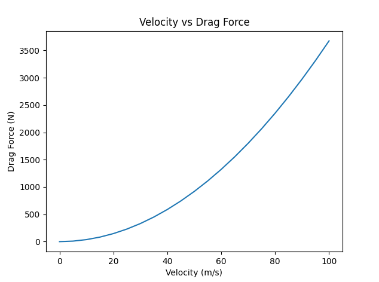
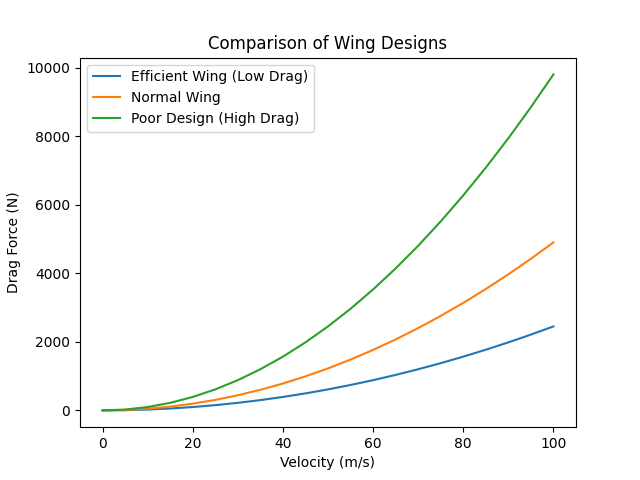
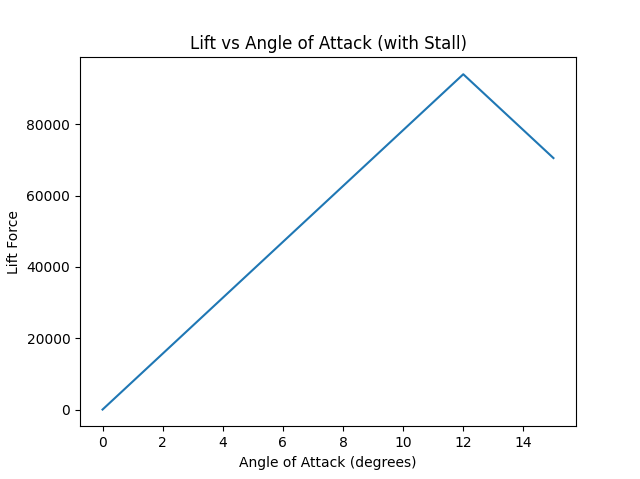

# Aerodynamics Simulation Project

This project explores aerodynamic principles through computational modeling using Python.

## Features
- Drag force calculation using physical equations
- Visualization of drag vs velocity
- Comparison of different wing designs
- Optimization of aerodynamic configurations
- Lift modeling with constraints
- Simulation of angle of attack and stall behavior

## Sample Outputs

### Drag vs Velocity

### Wing Design Comparison

### Angle of Attack (Stall)

## Key Insights
- Drag increases quadratically with velocity
- Wing design significantly impacts aerodynamic efficiency
- Lift and drag are interdependent, creating trade-offs
- Increasing angle of attack increases lift up to a critical point, after which stall occurs

## Purpose
This project was developed to explore how computational tools can model real-world aerodynamic behavior and design trade-offs in aircraft engineering.
